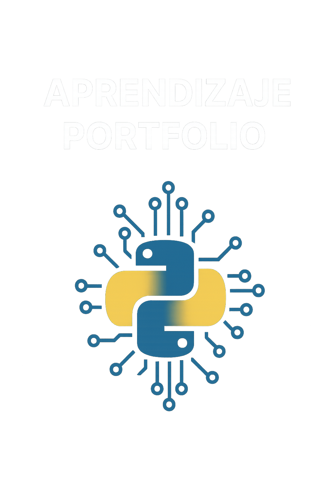

# 🧠 Portafolio de Aprendizaje y Proyectos

<p align="center">
  
</p>

Bienvenido a mi portafolio digital. Este repositorio es un espacio vivo donde documento mi proceso de aprendizaje, desarrollo proyectos y comparto recursos útiles relacionados principalmente con **Python**, aunque también incluiré otras tecnologías conforme avance en nuevos cursos y retos.

## 🚀 ¿Qué encontrarás aquí?

- 📘 **Cursos realizados**:
    - **Python Básico** – Fundamentos del lenguaje, sintaxis, estructuras de control funciones.
- 🧪 **Proyectos prácticos**:
- 💡 **Tips y buenas prácticas**: Consejos útiles sobre Python y otras herramientas de  programación.

## 🛠️ Tecnologías principales

- Python (enfocado en fundamentos, buenas prácticas, automatización, etc.)

## 📦 Estructura del repositorio
```bash
📁 cursos1/
   └── primer-proyecto/
📁 Shorts/
📄 README.md